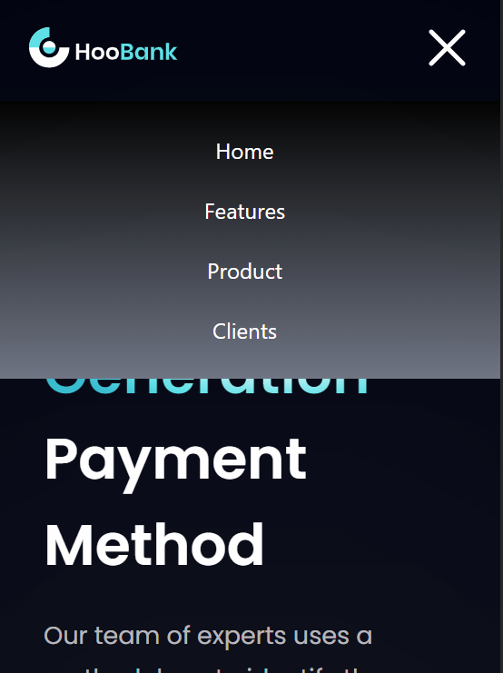

# HOO Bank 

I developed this project to get an hands on experience on tailwind css
This project is developed by taking JS mastery you-tube channel video tailwind css project into reference 

## Figma link for this project : https://www.figma.com/file/bUGIPys15E78w9bs1l4tgS/HooBank?type=design&node-id=310-485&mode=design&t=MP2HKqSYinYyEK4v-0 

### Desktop view of the website is

### Mobile view 

# Jenkins SMTP Configuration
  - Jenkins --> Manage Jenkins --> System --> E-mail Notification --> SMTP server (smtp.gmail.com) --> Check Use SMTP Authentication
    --> Username (mail id) --> Password [goto https://myaccount.google.com/apppasswords --> Give name] --> Check Use SSL --> Add
    Reply-To Address mail --> 
  
  - Advanced properties
    
    mail.smtp.auth=true
    mail.smtp.starttls.enable=true
    mail.smtp.starttls.required=true
    mail.smtp.ssl.trust=smtp.gmail.com
    mail.smtp.connectiontimeout=10000
    mail.smtp.timeout=20000

